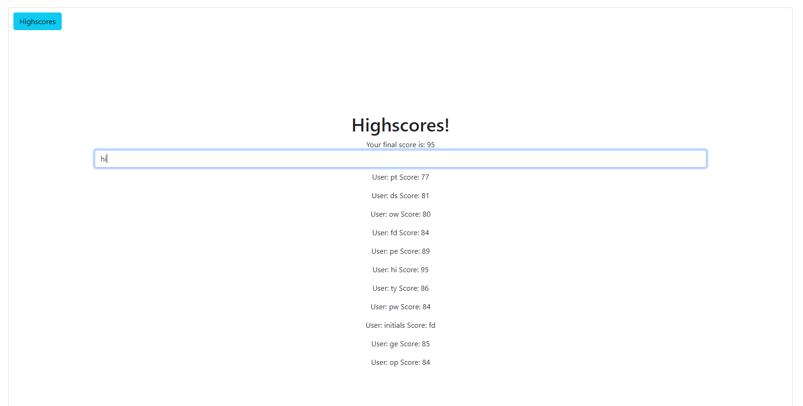

# Timed Quiz Project



This site was made to quiz your knowledge of animals! Right now there are three questions that each have four possible answers but one correct answer. You are given 100 seconds to complete the quiz and 10 seconds are removed from the timer if you pick a wrong answer. Feedback is given when you click an incorrect or a correct answer. Afterwards there is a summary interface to let you know your score, which is your time remaining, and allows you to input your initials. This information will be stored locally!

## Snips of code

Below is a code snippet of my timer. Setting the setInterval function equal to time allows me to clear the time whenever it is necessary, such as when a game over is reached or the summary interface is shown.

```
    time = setInterval(function() {
        timeLeft--;
        if (timeLeft > 0) {
            timerEl.textContent = timeLeft + " seconds left";
            
        }
        else {
            timerEl.textContent = "";
            clearInterval(time);
            gameOver();
        }
        
    }, 1000)
```

The code snippet below shows how the keys and values from local storage are retrieved. I found a way to retrieve the key and the value so I set the user's initials to be the key and the score to be the value!

```
function highScores() {
    ...
    for (i = 0; i < localStorage.length; i++){
        var key = window.localStorage.key(i);
        var value = window.localStorage.getItem(localStorage.key(i));
        var list = document.createElement("p");
        list.textContent = "User: "+ key + " Score: " + value;
        highscoreList.appendChild(list)
    }
```

## Built With

* [HTML](https://developer.mozilla.org/en-US/docs/Web/HTML)
* [CSS](https://developer.mozilla.org/en-US/docs/Web/CSS)
* [JS](https://www.javascript.com/)
* [GitHub](https://github.com/)
* [Git](https://git-scm.com/)
* [Bootstrap](https://getbootstrap.com/docs/5.0/getting-started/introduction/)

## Deployed Link

* [See Live Site](https://pting1995.github.io/timed-quiz/)

## Authors

* Peter Ting

- [Link to Github](https://github.com/Pting1995)
- [Link to LinkedIn](https://www.linkedin.com/in/pting002/)

## License

This project is licensed under the MIT License 

## Acknowledgments

* Thank you to UC Berkeley's Extension Bootcamp for giving me the opportunity to work on this project!